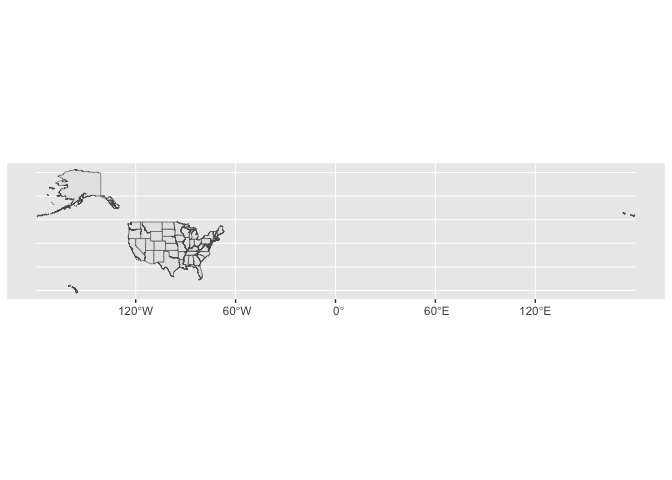
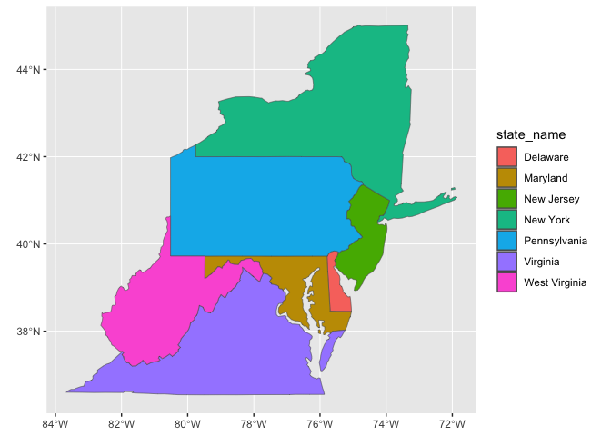
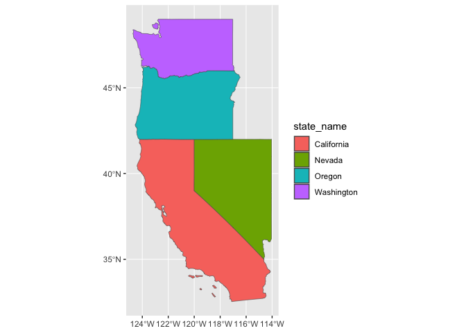

<!-- README.md is generated from README.Rmd. Please edit that file -->

# ggstates

A package to map US state polygons easily from flat file.

Note on name: ggusa felt too silly and ggunitedstatesamerica felt too
long. There are other countries w/ ‘states’ in their name.

R’s convenience datasets uses ‘state’ to refer to US states.

``` r
state.abb
state.area
state.center
state.division
state.name
state.region
state.x77
```

<!-- badges: start -->

<!-- badges: end -->

## Installation

You can install the development version of ggstates from
[GitHub](https://github.com/) with:

``` r
# install.packages("devtools")
devtools::install_github("EvaMaeRey/ggstates")
```

## without ggstates

``` r
library(sf)
#> Linking to GEOS 3.10.2, GDAL 3.4.2, PROJ 8.2.1; sf_use_s2() is TRUE
library(tidyverse)
#> ── Attaching core tidyverse packages ──────────────────────── tidyverse 2.0.0 ──
#> ✔ dplyr     1.1.0     ✔ readr     2.1.4
#> ✔ forcats   1.0.0     ✔ stringr   1.5.0
#> ✔ ggplot2   3.4.1     ✔ tibble    3.2.0
#> ✔ lubridate 1.9.2     ✔ tidyr     1.3.0
#> ✔ purrr     1.0.1
#> ── Conflicts ────────────────────────────────────────── tidyverse_conflicts() ──
#> ✖ dplyr::filter() masks stats::filter()
#> ✖ dplyr::lag()    masks stats::lag()
#> ℹ Use the conflicted package (<http://conflicted.r-lib.org/>) to force all conflicts to become errors

states_attributes <- state.x77 %>% 
  data.frame() %>% 
  rownames_to_column(var = "state")


# https://www.census.gov/geographies/mapping-files/time-series/geo/carto-boundary-file.html
states_geometries <- read_sf("data-raw/cb_2018_us_state_20m/cb_2018_us_state_20m.shp") %>%   
  filter(NAME != "Puerto Rico",
         NAME != "District of Colombia") %>% 
  select(STUSPS, NAME, geometry)


states_attributes %>% 
  left_join(states_geometries, by = c("state" = "NAME")) %>% 
ggplot() + 
  aes(geometry = geometry, state = state.name) +
  geom_sf() + 
  coord_sf() + 
  aes(fill = Income)
```


# With ggstates

``` r
library(ggplot2)
library(ggstates)
#> 
#> Attaching package: 'ggstates'
#> The following object is masked _by_ '.GlobalEnv':
#> 
#>     states_attributes

state_attributes |> head()
#>   state_name Population Income Illiteracy Life.Exp Murder HS.Grad Frost   Area
#> 1    Alabama       3615   3624        2.1    69.05   15.1    41.3    20  50708
#> 2     Alaska        365   6315        1.5    69.31   11.3    66.7   152 566432
#> 3    Arizona       2212   4530        1.8    70.55    7.8    58.1    15 113417
#> 4   Arkansas       2110   3378        1.9    70.66   10.1    39.9    65  51945
#> 5 California      21198   5114        1.1    71.71   10.3    62.6    20 156361
#> 6   Colorado       2541   4884        0.7    72.06    6.8    63.9   166 103766

library(ggplot2)
ggplot(state_attributes) +
aes(state = state_name) +
geom_state()
#> Joining with `by = join_by(state)`
```



``` r

ggplot(state_attributes) +
aes(state = state_name) +
geom_state(drop_state = c("Hawaii", "Alaska"))
#> Joining with `by = join_by(state)`
```


``` r

ggplot(state_attributes) +
aes(state = state_name) +
geom_state(drop_state = c("Hawaii", "Alaska")) +
aes(fill = Frost)
#> Joining with `by = join_by(state)`
```


``` r

last_plot() + 
  aes(fill = Population)
#> Joining with `by = join_by(state)`
```


``` r

last_plot() + 
  aes(fill = Area)
#> Joining with `by = join_by(state)`
```


``` r

ggplot(state_attributes) +
  aes(state = state_name) +
  geom_state(keep_state = c("New York", "Virginia", 
                            "Maryland", "West Virginia",
                            "Pennsylvania",
                            "New Jersey", "Delaware")) + 
  aes(fill = state_name)
#> Joining with `by = join_by(state)`
```



``` r

ggplot(state_attributes) +
  aes(state = state_name) +
  geom_state(keep_state = c("CA", "WA", 
                            "OR", "NV")) + 
  aes(fill = state_name)
#> Joining with `by = join_by(state)`
```


